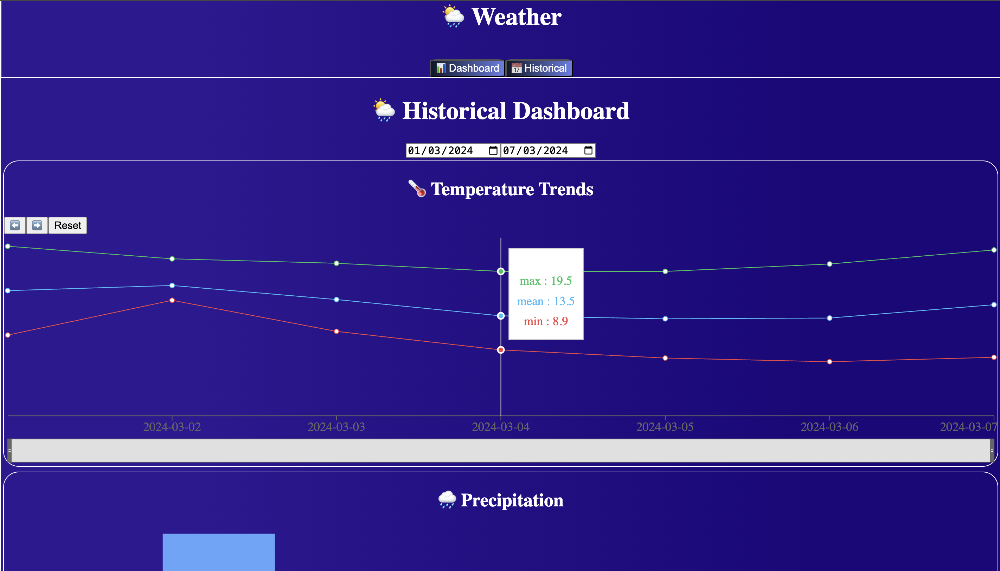
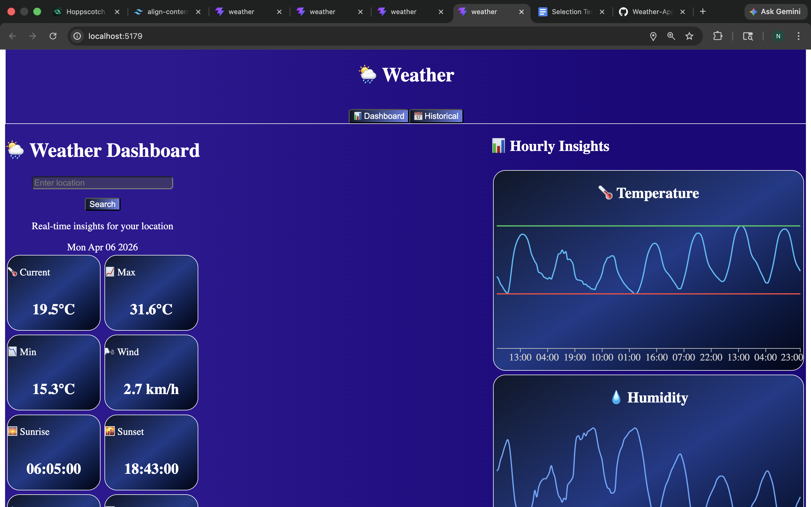

# 🌦 Weather Dashboard

A modern, responsive weather dashboard built using ReactJS and Open-Meteo API.

---

## 🚀 Features

- 📍 GPS-based location detection
- 🌡 Real-time weather data
- 📊 Hourly weather charts
- 📅 Historical data analysis
- 📱 Fully responsive design

---

## 🛠 Tech Stack

- ReactJS (Vite)
- Tailwind CSS
- Recharts
- Axios

---

## 🌐 Live Demo

(https://weather-app-xi-six-80.vercel.app/)

---

## ⚙️ Setup

npm install  
npm run dev  

---

## 📸 Screenshots

### Home Page

### Dashboard View

---

## 👨‍💻 Author

Nishant Bairagi